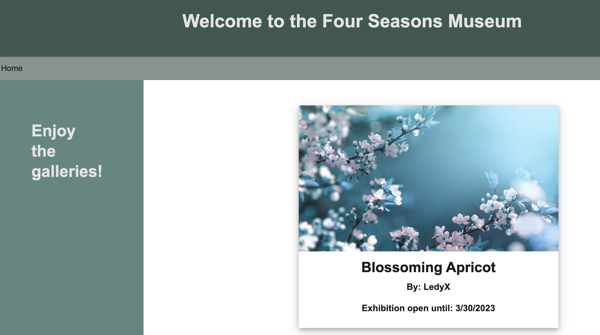

# 🐛 Date Is Not Formatted Correctly

Work with a partner to resolve the following issues:

* Museum visitors should be able to see the end date of each painting on the painting page.

## Expected Behavior

* When a museum visitor visits the painting page, it should clearly and accurately show the date that the exhibition will end.

* The end date is calculated by adding five years to the painting's `exhibition_date`.

* The end date should be formatted as `M/D/YYYY`.

## Actual Behavior

When a museum visitor visits the exhibition page, it shows the painting's `exhibition_date` in the original long timestamp format.

## Assets

The following image demonstrates the correct formatting of the end date for each painting:

---

## 💡 Hints

Which JavaScript Date methods allow you to return the month, date, and year of a specified date? How do you correctly render the month, considering that it is returned as a zero-based value?

## 🏆 Bonus

If you have completed this activity, work through the following challenge with your partner to further your knowledge:

* What other data can be formatted by custom helpers?

Use [Google](https://www.google.com) or another search engine to research this.

---
© 2023 edX Boot Camps LLC. Confidential and Proprietary. All Rights Reserved.