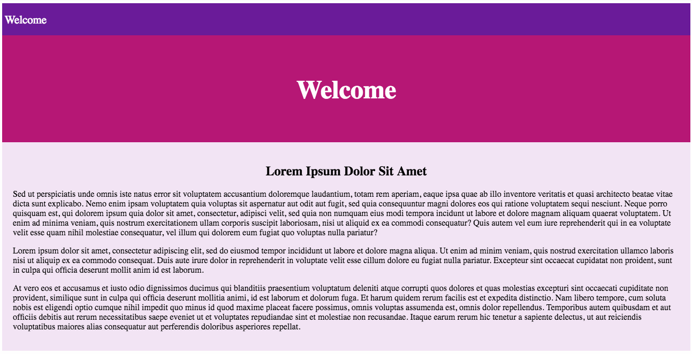

# Style Prop

In this activity we will explore some built-in options for styling React components.

## Instructions

* Run `npm i` to download all the required node modules.

* Start the app by running `npm start` in your terminal, take a moment to study the HTML code being rendered in the browser at [http://localhost:3000](http://localhost:3000).

  

* This application consists of three main components:

  * `Header`

  * `Navbar`

  * `Section`

* Each component is styled using imported external stylesheets.

* Using only inline styles, and without altering any of the CSS files, update each component so the rendered page looks like this:

  

### Hints

* Check out the [React documentation for the style attribute](https://facebook.github.io/react/docs/dom-elements.html#style)

* Check out the [Inline CSS Section of the React Enlightenment Book](https://www.reactenlightenment.com/react-jsx/5.6.html)
