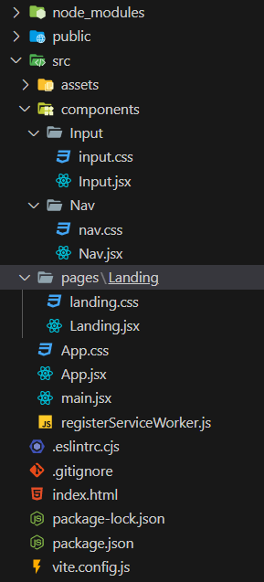

# React

## Page Setup

React is great for a lot of reasons. One of those reasons is how organized it can keep us through development. We have to think about how our page will be built before we get to building it. 

The organization process is extremely important with react.

This exercise is part 1 in a larger group of exercises. In step 1, we'll be setting our app up for success.

### Instructions

1. In the command line, navigate to the desired parent folder and run `npm create vite@latest`.

    * 🔑 *Note*: This command will automatically create a sub-folder which will house your React application; you do not need to perform a `mkdir` command to create one manually.

2. Enter `news` as the desired name of your new project folder.

3. From the first list of options, select your framework; for our activities in class, we'll be using `React`.

4. From the second list of options, select your variant; for our activities in class, we'll be using `JavaScript`.

5.  Once the ensuing installation has finished, open the directory that command created within the root of this folder. Navigate to the `src` folder within that directory.

6. Within `src`, create two folders:
  - `components`
  - `pages`

7. Within pages, create the folder `Landing`. Within `Landing`, create the following files:
  - `Landing.jsx`
  - `landing.css`

8. Within `components`, create the following folders:
  - `Nav`
  - `Input`

9. Within `Nav` and `Input`, follow the same structure as `Landing`. In other words, each folder should contain its own name with the .jsx extension, and its own name in lowercase with the .css extension.

10. delete everything from the App.css and add this:

``` css
    /* Reset CSS for cross-browser compatibility */
    *,
    *::after,
    *::before {
      margin: 0;
      padding: 0;
      /* allows other elements to inherit box-sizing specified in body */
      box-sizing: inherit;
    }

    html {
      /* this makes it a lot easier to calcute rem. 62.5 is 10/16 so our    defualt fontsize is relative to user settings. defines what 1 rem is */
      scroll-behavior: smooth;
      font-size: 62.5%;

    }

    body {
        /* makes it so that padding and width don't add to total size of    element. i.e. height and width will now extend to define other parts    of the box model */
        box-sizing: border-box;
        margin: 0;
        padding: 0;
        font-family: sans-serif;      
    }
```
11. delete everything in the index.css and the link to it from the main.jsx


#### Your file structure should look like this:
